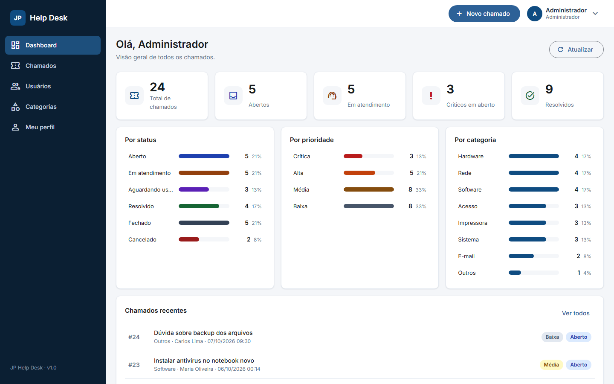
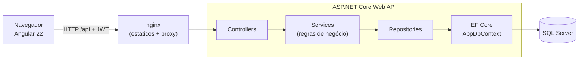
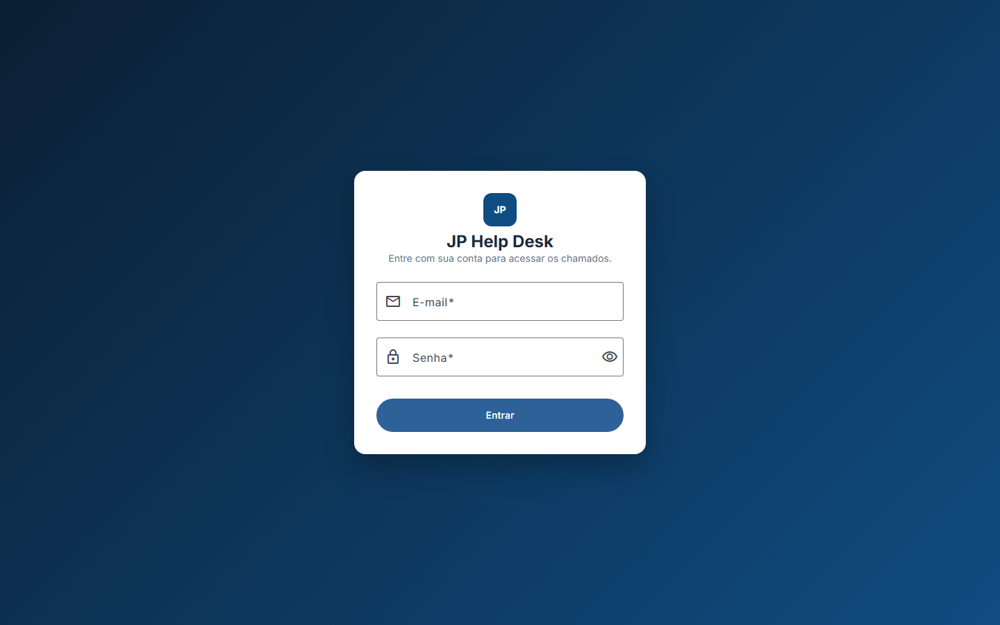
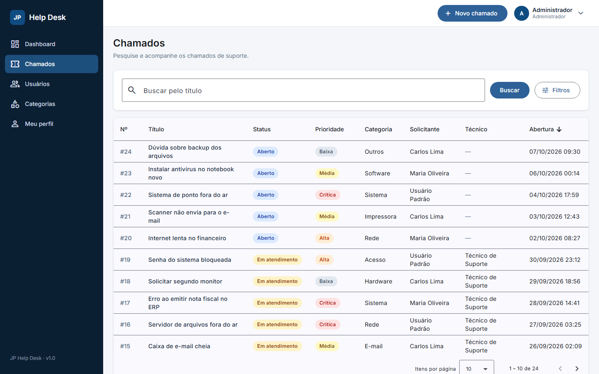
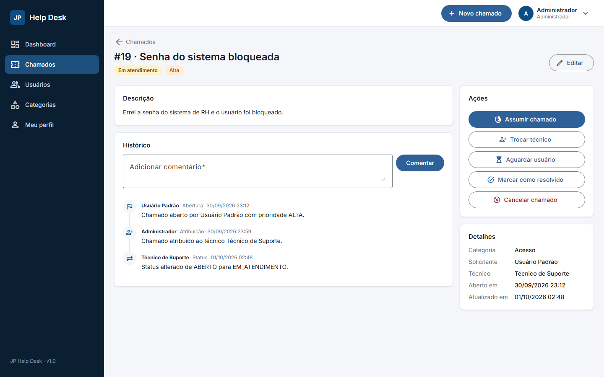
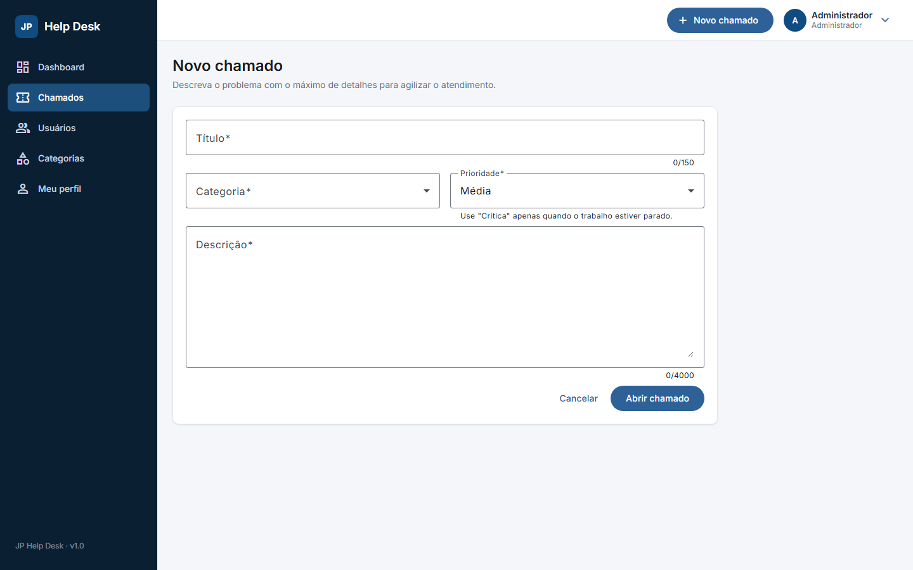
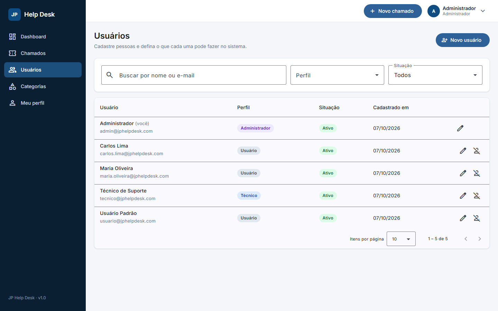
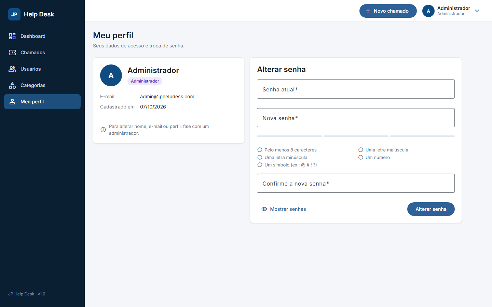
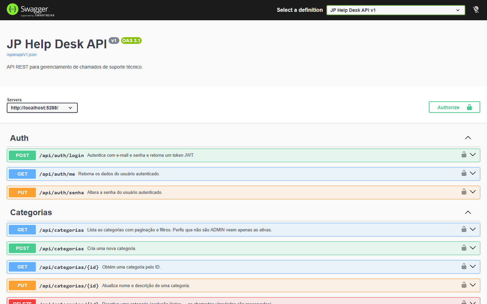
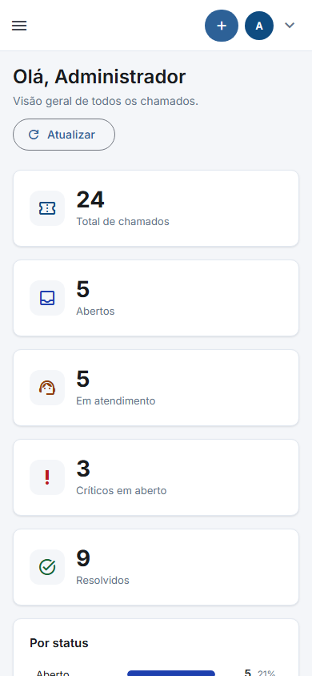

# JP Help Desk

[](https://github.com/jooaoantoniio/jp-help-desk/actions/workflows/ci.yml)

Sistema de **Service Desk de TI** para abrir, atribuir, acompanhar e encerrar chamados de suporte técnico, com
perfis de acesso, histórico completo de cada chamado e um dashboard com os indicadores do atendimento.

**Backend:** C# · .NET 10 · ASP.NET Core Web API · EF Core · SQL Server · JWT  
**Frontend:** Angular 22 · TypeScript · Angular Material · RxJS  
**Qualidade:** 76 testes no backend (xUnit) · 58 no frontend (Vitest) · Docker



---

## Sumário

- [Sobre o projeto](#sobre-o-projeto)
- [Funcionalidades](#funcionalidades)
- [Tecnologias](#tecnologias)
- [Arquitetura](#arquitetura)
- [Como executar](#como-executar)
- [Usuários de teste](#usuários-de-teste)
- [Endpoints da API](#endpoints-da-api)
- [Testes](#testes)
- [Decisões de segurança](#decisões-de-segurança)
- [Screenshots](#screenshots)
- [Roadmap](#roadmap)

## Sobre o projeto

O JP Help Desk nasceu da rotina de suporte de TI: chamados chegam por vários canais, se perdem, ninguém sabe
quem está atendendo e não há histórico do que foi feito. O sistema organiza esse fluxo:

1. O **usuário** abre um chamado escolhendo categoria e prioridade.
2. Um **técnico** assume (ou o **administrador** atribui) e conduz o atendimento.
3. Cada mudança de status, edição e comentário fica registrada na **linha do tempo** do chamado.
4. O solicitante **confirma a solução** (ou reabre, se o problema voltar).

**Objetivo:** projeto de portfólio construído em 20 etapas, do ambiente ao deploy, aplicando as práticas
esperadas de um desenvolvedor .NET/Full Stack: API REST em camadas, autenticação e autorização,
validação consistente, testes automatizados, containerização e documentação.

## Funcionalidades

**Chamados**
- Abertura, edição, cancelamento e acompanhamento, com fluxo de status controlado (máquina de estados):

  ```
  ABERTO → EM_ATENDIMENTO ⇄ AGUARDANDO_USUARIO → RESOLVIDO → FECHADO
     ↘ CANCELADO (de qualquer status em aberto)        ↘ reabrir (volta a EM_ATENDIMENTO)
  ```
- Prioridades `BAIXA`, `MEDIA`, `ALTA` e `CRITICA`; categorias gerenciáveis (8 cadastradas inicialmente).
- Técnico assume o chamado; administrador atribui ou troca o técnico.
- Comentários e **histórico** de abertura, atribuições, mudanças de status e edições.
- Listagem com **filtros** (número, título, status, prioridade, categoria, solicitante, técnico e período),
  **ordenação** e **paginação** — os filtros ficam na URL (dá para compartilhar e usar o botão Voltar).

**Perfis e permissões**

| Ação | USUARIO | TECNICO | ADMIN |
|---|:-:|:-:|:-:|
| Abrir chamado e comentar | ✅ | ✅ | ✅ |
| Ver chamados | só os seus | todos | todos |
| Editar chamado | só o seu, enquanto `ABERTO` | ✅ | ✅ |
| Alterar status | cancelar, confirmar ou reabrir o seu | ✅ | ✅ |
| Assumir chamado | ❌ | ✅ | ✅ |
| Atribuir técnico | ❌ | ❌ | ✅ |
| Gerenciar usuários e categorias | ❌ | ❌ | ✅ |

Os botões de ação da tela vêm do campo `proximosStatus` da API: o frontend não duplica as regras de permissão.

**Outros**
- **Dashboard** com totais, gráficos por status, prioridade e categoria, e chamados recentes (cada barra leva à lista já filtrada).
- **Gestão de usuários** (ADMIN) com ativação/desativação — o sistema nunca fica sem um administrador ativo.
- **Meu perfil** com troca de senha e indicador de força.
- Interface **responsiva** (tabela no desktop, cartões no mobile) e mensagens de erro em português.

## Tecnologias

| Camada | Tecnologias |
|---|---|
| **API** | .NET 10, ASP.NET Core Web API, Entity Framework Core 10, SQL Server 2025 Express |
| **Segurança** | JWT (HS256), BCrypt (custo 12), autorização por políticas, rate limiting no login |
| **Documentação da API** | OpenAPI nativo do .NET + Swagger UI, com comentários XML |
| **Frontend** | Angular 22 (standalone, zoneless, signals), TypeScript, Angular Material 3, RxJS, Reactive Forms |
| **Testes** | xUnit v3 + `WebApplicationFactory` (backend), Vitest (frontend) |
| **Infra** | Docker (imagens multi-stage), docker-compose, nginx |

## Arquitetura



> Em desenvolvimento, o `ng serve` faz o papel do nginx (proxy de `/api` em `proxy.conf.json`).

**Backend em camadas** — `Controller → Service → Repository → AppDbContext`:
- **Controllers** só traduzem HTTP (rotas, status codes, documentação); a regra de negócio fica nos **Services**.
- **DTOs** separam o contrato da API das entidades do banco (senha e hash nunca saem da API).
- **Exceções de domínio** (`RecursoNaoEncontrado`, `Conflito`, `RegraNegocio`, `AcessoNegado`) viram respostas
  **ProblemDetails (RFC 9457)** num handler global — sem `try/catch` espalhado pelos controllers.
- Regras puras e testáveis isoladamente: `FluxoStatusChamado` (máquina de estados) e `PermissoesChamado`.
- Histórico gravado na **mesma transação** da alteração (um único `SaveChanges`).
- Exclusão lógica: usuários e categorias são desativados; chamados são cancelados — nada se perde do histórico.

**Frontend** — componentes standalone, estado com **signals**, dados com `httpResource`/`rxResource`,
interceptor funcional que anexa o token e encerra a sessão expirada, guards por perfil e rotas carregadas
sob demanda (bundle inicial de ~98 kB comprimido).

O modelo de dados (diagrama ER e decisões) está em [docs/modelo-de-dados.md](docs/modelo-de-dados.md).

```
├── backend/
│   ├── JpHelpDesk.Api/          # API: Controllers, Services, Repositories, Data, DTOs, Models...
│   └── JpHelpDesk.Api.Tests/    # Testes: Unidade/ e Integracao/
├── frontend/jp-help-desk/       # Angular: pages/, components/, services/, guards/, interceptors/
├── docs/                        # Modelo de dados e screenshots
└── docker-compose.yml
```

## Como executar

Há dois caminhos: **Docker** (só precisa do Docker) ou **local** (para desenvolver).

### Opção 1 — Docker

Pré-requisito: [Docker Desktop](https://www.docker.com/products/docker-desktop/) (ou Docker Engine + Compose).

```bash
cp .env.example .env        # preencha as três variáveis (instruções no próprio arquivo)
docker compose up --build
```

Acesse **http://localhost:8080** (Swagger em http://localhost:8080/swagger). O compose sobe o SQL Server,
a API (que cria o banco pelas migrations e carrega dados de demonstração) e o frontend servido pelo nginx.
Os segredos ficam no `.env`, que não é versionado.

### Opção 2 — Local

**Pré-requisitos:** [.NET SDK 10](https://dotnet.microsoft.com/download), [Node.js 24](https://nodejs.org/) e
SQL Server (Express serve) ou LocalDB.

**1. Banco de dados.** A conexão de desenvolvimento está em
`backend/JpHelpDesk.Api/appsettings.Development.json` e aponta para `.\SQLEXPRESS` com autenticação do Windows.
Se o seu SQL Server for outro, ajuste a connection string `DefaultConnection`. Depois crie o banco:

```bash
dotnet tool restore                                     # instala o dotnet-ef definido em dotnet-tools.json
dotnet ef database update --project backend/JpHelpDesk.Api
```

**2. Segredos de desenvolvimento** (ficam no seu perfil de usuário via
[User Secrets](https://learn.microsoft.com/aspnet/core/security/app-secrets), nunca no repositório):

```bash
cd backend/JpHelpDesk.Api
dotnet user-secrets set "Jwt:ChaveSecreta" "<no mínimo 32 caracteres aleatórios>"
dotnet user-secrets set "Seed:SenhaUsuariosTeste" "<senha dos usuários de teste>"
```

> Para gerar uma chave no PowerShell:
> `$b = New-Object byte[] 64; [Security.Cryptography.RandomNumberGenerator]::Create().GetBytes($b); [Convert]::ToBase64String($b)`
> — no Linux/macOS: `openssl rand -base64 64`.

**3. API** (http://localhost:5288 · Swagger em http://localhost:5288/swagger):

```bash
dotnet run --project backend/JpHelpDesk.Api
```

Na primeira execução em `Development`, a API cria os usuários de teste e 24 chamados de demonstração.

**4. Frontend** (http://localhost:4200):

```bash
cd frontend/jp-help-desk
npm install
npm start
```

## Usuários de teste

Criados automaticamente em desenvolvimento, todos com a senha definida em `Seed:SenhaUsuariosTeste`
(ou `SENHA_USUARIOS_TESTE` no Docker):

| E-mail | Perfil |
|---|---|
| `admin@jphelpdesk.com` | ADMIN |
| `tecnico@jphelpdesk.com` | TECNICO |
| `usuario@jphelpdesk.com` | USUARIO |

Os dados de demonstração incluem ainda `maria.oliveira@` e `carlos.lima@jphelpdesk.com` (USUARIO).

## Endpoints da API

Todos exigem token JWT (`Authorization: Bearer {token}`), exceto login e health check. A documentação
interativa completa, com exemplos, fica no Swagger.

| Método | Rota | Descrição | Acesso |
|---|---|---|---|
| `POST` | `/api/auth/login` | Login; devolve o token JWT | público (limite de 10/min por IP) |
| `GET` | `/api/auth/me` | Dados do usuário logado | autenticado |
| `PUT` | `/api/auth/senha` | Troca a própria senha | autenticado |
| `GET` | `/api/chamados` | Lista com filtros, ordenação e paginação | autenticado¹ |
| `POST` | `/api/chamados` | Abre um chamado | autenticado |
| `GET` | `/api/chamados/{id}` | Detalhe, com `proximosStatus` permitidos | autenticado¹ |
| `PUT` | `/api/chamados/{id}` | Edita título, descrição, prioridade e categoria | autenticado¹ |
| `PATCH` | `/api/chamados/{id}/status` | Altera o status (com observação opcional) | autenticado¹ |
| `PATCH` | `/api/chamados/{id}/assumir` | O técnico logado assume o chamado | TECNICO, ADMIN |
| `PATCH` | `/api/chamados/{id}/atribuir` | Atribui ou troca o técnico | ADMIN |
| `DELETE` | `/api/chamados/{id}` | Cancela (exclusão lógica) | autenticado¹ |
| `GET` | `/api/chamados/{id}/historico` | Linha do tempo do chamado | autenticado¹ |
| `POST` | `/api/chamados/{id}/comentarios` | Adiciona comentário | autenticado¹ |
| `GET` | `/api/dashboard` | Indicadores (USUARIO vê só os seus) | autenticado |
| `GET` | `/api/categorias` | Lista (não-ADMIN vê só as ativas) | autenticado |
| `POST` `PUT` `DELETE` | `/api/categorias[/{id}]` | Cria, edita e desativa | ADMIN |
| `PATCH` | `/api/categorias/{id}/ativar` | Reativa | ADMIN |
| `GET` `POST` `PUT` `DELETE` | `/api/usuarios[/{id}]` | Lista, cadastra, edita e desativa | ADMIN |
| `PATCH` | `/api/usuarios/{id}/ativar` | Reativa | ADMIN |
| `GET` | `/api/health` | Status da API | público |

¹ O USUARIO só acessa os próprios chamados; um chamado de outra pessoa responde **404** (não revela que existe).

**Erros** seguem o padrão ProblemDetails, em português, com os nomes de campo iguais aos do JSON:

```json
{
  "title": "Um ou mais campos são inválidos.",
  "status": 400,
  "detail": "Corrija os campos indicados em \"errors\" e tente novamente.",
  "errors": { "perfil": ["Valor inválido. Valores aceitos: ADMIN, TECNICO, USUARIO."] }
}
```

## Testes

```bash
dotnet test --solution backend/JpHelpDesk.slnx              # 76 testes (unidade + integração)
cd frontend/jp-help-desk && npx ng test --watch=false       # 58 testes
```

- **Unidade:** fluxo de status, permissões por perfil, BCrypt, geração do JWT (com relógio fixo via
  `TimeProvider`), regra do último administrador (com repositório em memória).
- **Integração:** a API inteira sobe em memória (`WebApplicationFactory`) e recebe requisições HTTP reais —
  login, token adulterado e revogado, permissões, ciclo completo do chamado com histórico, filtros,
  formato dos erros e o limite de tentativas de login (429).
- Os testes de integração usam um banco **descartável** (`JpHelpDesk_Testes`), criado pelas migrations e
  apagado ao final, com chave JWT aleatória — nenhum segredo real. Para outro servidor, defina
  `JPHELPDESK_TESTES_CONNECTION`.
- **Frontend:** serviços, guards, interceptor, mapeamento de filtros ↔ URL, regras de senha e componentes.

## Decisões de segurança

- **Nenhum segredo no repositório:** User Secrets em desenvolvimento, variáveis de ambiente (`.env`) no Docker.
  A API não sobe sem uma chave JWT válida (validação na inicialização).
- **Senhas** com BCrypt e política de senha forte; o hash nunca sai da API.
- **Login** com mensagem única para e-mail inexistente e senha errada, tempo de resposta equalizado e
  **rate limiting** por IP (proteção contra força bruta e enumeração de usuários).
- **Tokens revogáveis:** a cada requisição a API confere se o usuário continua ativo e com o mesmo perfil —
  desativar alguém ou mudar seu perfil invalida os tokens já emitidos.
- **Protegido por padrão:** todo endpoint exige autenticação, salvo os marcados como públicos.
- **Erros sem vazamento:** respostas de erro não expõem stack trace nem nomes de tipos internos.
- **Contêineres** rodando como usuário sem privilégios; só a porta do frontend é publicada.

## Screenshots

| | |
|---|---|
|  **Login** |  **Lista com filtros e paginação** |
|  **Detalhe, ações e histórico** |  **Abertura de chamado** |
|  **Gestão de usuários** |  **Troca de senha** |
|  **Documentação da API** |  **Versão mobile** |

## Roadmap

- [x] Pipeline de CI no GitHub Actions (build, testes, imagens Docker e smoke test do docker-compose)
- [ ] Deploy público da aplicação
- [ ] Textos do histórico com rótulos amigáveis (hoje: "de ABERTO para EM_ATENDIMENTO")
- [ ] Notificações por e-mail ao solicitante a cada mudança de status
- [ ] Anexos (prints e logs) nos chamados
- [ ] SLA por prioridade, com alerta de chamados atrasados
- [ ] Refresh token e recuperação de senha por e-mail
- [ ] Testes end-to-end automatizados no repositório (Playwright)
