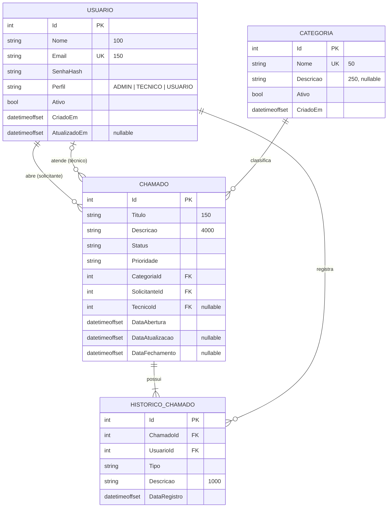

# Modelo de dados — JP Help Desk

## Diagrama entidade-relacionamento

## Enumerações

| Enum | Valores |
|---|---|
| `PerfilUsuario` | `ADMIN`, `TECNICO`, `USUARIO` |
| `StatusChamado` | `ABERTO`, `EM_ATENDIMENTO`, `AGUARDANDO_USUARIO`, `RESOLVIDO`, `FECHADO`, `CANCELADO` |
| `PrioridadeChamado` | `BAIXA`, `MEDIA`, `ALTA`, `CRITICA` |
| `TipoHistorico` | `ABERTURA`, `ATRIBUICAO`, `ALTERACAO_STATUS`, `ALTERACAO_DADOS`, `COMENTARIO` |

## Decisões de modelagem

- **Enums gravados como texto** (`varchar`) e não como número: o banco fica legível
  (`WHERE Status = 'ABERTO'`) e reordenar o enum no código não corrompe dados.
- **`DateTimeOffset` em UTC**: datas guardam o fuso, evitando ambiguidade entre servidor e cliente.
  A conversão para o horário local é responsabilidade do frontend.
- **Exclusão restrita (`Restrict`)** nas chaves para `Usuario` e `Categoria`: não é possível
  apagar um usuário ou categoria com chamados vinculados — eles são **desativados** (`Ativo = false`).
- **Histórico em cascata**: o histórico pertence ao chamado; removido o chamado, remove-se o histórico.
- **Comentários e observações** de técnicos e usuários são registros de histórico do tipo `COMENTARIO`,
  mantendo uma linha do tempo única por chamado.
- **Índices** em `Chamado.Status`, `Chamado.Prioridade` e `Chamado.DataAbertura` para filtros e dashboard;
  índices únicos em `Usuario.Email` e `Categoria.Nome`.
